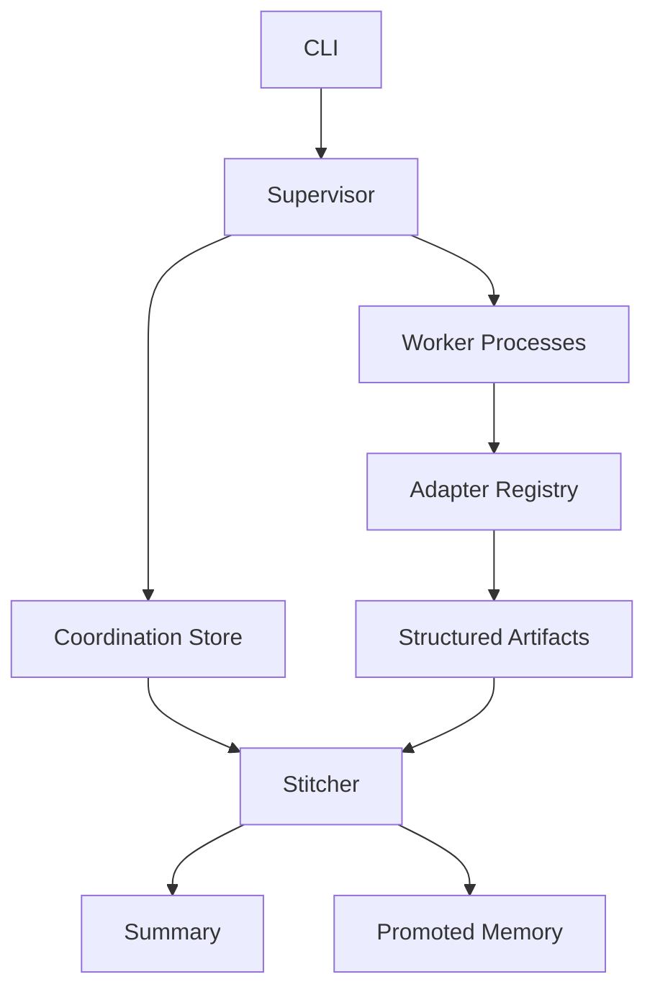

# Architecture

Puppetmaster treats agent swarms like distributed systems rather than group chats.



## Core Objects

- `Job`: one swarm run and user goal.
- `Task`: a role-specific unit of work, optionally dependent on other tasks.
- `AgentRun`: one attempt by one worker process.
- `Artifact`: structured worker output with evidence, confidence, payload, and `sha256`.
- `MemoryRecord`: promoted facts that future workers can retrieve.

## Runtime Flow

1. The CLI creates a `Job`.
2. The supervisor creates a task DAG.
3. Downstream tasks start as `blocked`.
4. Worker subprocesses claim ready tasks with leases.
5. Long-running workers heartbeat and renew leases.
6. Workers emit structured artifacts.
7. Stale leases can be recovered back to `queued`.
8. The stitcher reads artifacts only and writes `stitched.md`.

## Backends

The default backend is SQLite with WAL enabled. It stores jobs, tasks, runs, artifacts, memory, and events in `.puppetmaster/state.sqlite3`.

The file backend remains useful for debugging because every object is a readable JSON file.

## Failure Model

Workers are allowed to die. The lease expires, the task becomes recoverable, and another worker can reclaim it. The crash demo exercises this path.

```bash
python -m puppetmaster crash-demo
```

## Design Rules

- Workers do not communicate directly.
- Durable state goes through the coordination store.
- Final synthesis reads artifacts, not transcripts.
- Artifacts require evidence and type-specific payload fields.
- Optional providers must fail as structured artifacts, not runtime crashes.

